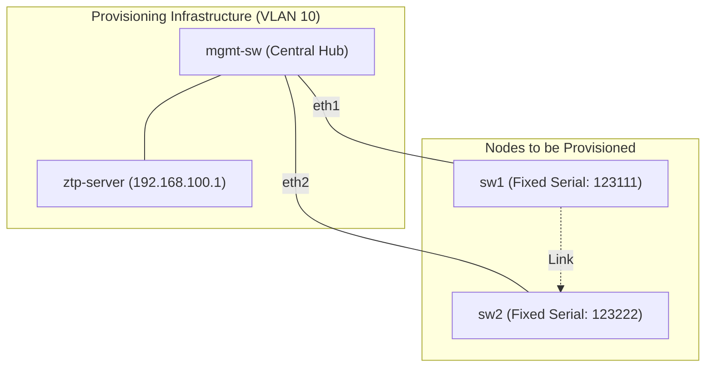

# Arista ZTP Lab for Containerlab

This project provides a robust, beginner-friendly example of **Zero Touch Provisioning (ZTP)** for Arista EOS switches using **Containerlab**. It demonstrates how network devices can automatically discover their configuration and bootstrap themselves into a production-ready state.

## 🚀 Key Features

- **Targeted Provisioning**: Documents how to pre-assign serial and MAC numbers to specific switches (`sw1`, `sw2`) before deployment, ensuring they always get the intended configuration.
- **Serial-Based Logic**: The bootstrap script identifies switches by their serial number, allowing for targeted configuration delivery.
- **Simulated Infrastructure**: Includes a management switch for Layer 2 connectivity and a Linux-based ZTP server.
- **Easy Cleanup**: One-command lab teardown and rebuild.

## 📐 Network Topology

The topology is defined in `ztp-ceos.yaml`. All nodes are connected to a management VLAN on the `mgmt-sw`.



## 🔍 How ZTP Works in this Lab

1.  **Boot**: `sw1` and `sw2` boot with `suppress-startup-config: true`, triggering Arista's native ZTP process.
2.  **Identity Injection**: Before deployment, we use `ceos-config` files to fix the serial and MAC numbers for each node. This prevents Containerlab from assigning random IDs on every boot.
3.  **DHCP Discovery**: The switches send DHCP requests on all interfaces.
4.  **DHCP Response**: The `ztp-server` (running `dnsmasq`) offers an IP and **DHCP Option 67**, pointing to `http://192.168.100.1:8080/bootstrap`.
5.  **Bootstrap Execution**: The switch downloads and runs the `bootstrap` Python script.
6.  **Serial Detection**: The script runs `FastCli -c "show version"` to detect the hardware serial number (e.g., `123111`).
7.  **Config Fetch**: 
    - It tries to fetch `<SERIAL>.cfg` (e.g., `123111.cfg`) from the server.
    - If no specific config exists, it falls back to `generic.cfg`.
8.  **Application**: The config is written to `/mnt/flash/startup-config`, and the device reboots (or applies) to complete provisioning.

## 📂 Project Structure

```text
.
├── DEPLOYMENT_GUIDE.md        # Detailed setup instructions
├── README.md                  # Project overview (you are here)
├── Dockerfile                 # Custom ZTP server image
├── dnsmasq.conf               # DHCP & Option 67 configuration
├── ztp-ceos.yaml              # Containerlab topology
├── docker-build-ztp-server.sh # Build script for the server
└── ztp-data/                  # Mounted directory for the HTTP server
    ├── bootstrap              # The Python ZTP bootstrap script
    └── configs/               # Folder for .cfg files
        ├── 123111.cfg         # Config for sw1
        ├── 123222.cfg         # Config for sw2
        ├── sw1/ceos-config    # Fixed identity for sw1
        └── sw2/ceos-config    # Fixed identity for sw2
```


---

For detailed setup instructions, see the [Deployment Guide](DEPLOYMENT_GUIDE.md).

